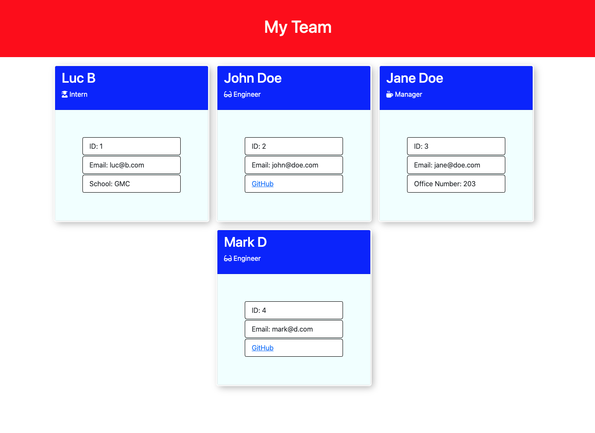

# Team Profile Generator

Generate a custom web-page containing cards of all your team members.

## Table of Contents
- [Getting Started](#getting-started)
- [Installation](#installation)
- [Testing](#testing)
- [Deployment](#deployment)
- [Visuals](#visuals)
- [Authors](#authors)

## Getting Started

To obtain a copy of this app, navigate to the [source code](https://github.com/lbburnsy/employee-creator), and clone on to your local machine.

## Installation

This app requires several dependencies to be installed before it will successfully run. To accomplish this, run:
```
npm install
```

## Testing

This app is delivered with several tests to ensure proper function. To test these files, navigate to the root folder of the application in your command line, and run:
```
npm run test
```

## Deployment

In order to run this program, navigate to the root folder of the application in your command line, and run: 
```
node index.js
```
Proceed to follow the commands on screen, and your custom HTML page will be created in the [output](./output) folder.

## Visuals



Running Tests


Using the interface


## Authors

[Luc Burns](https://github.com/lbburnsy)